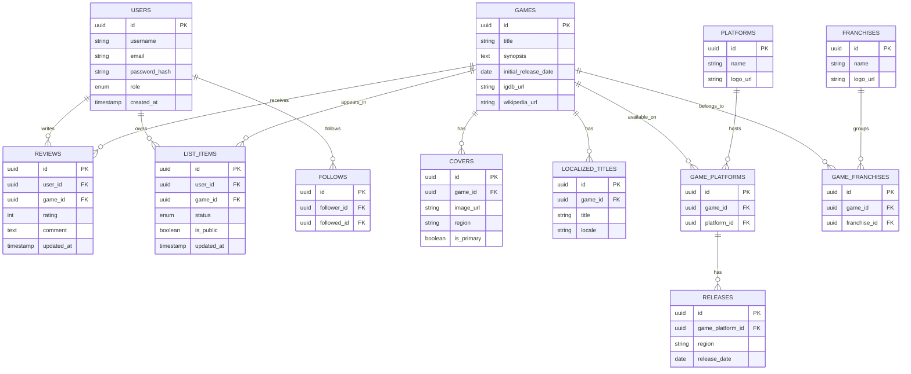

# Modelo de dados — Hitbox

Este documento descreve o modelo relacional do banco de dados do projeto Hitbox.

## Diagrama (ER)



> 💡 Esse diagrama é renderizado automaticamente quando visualizado no GitHub (ele entende blocos de código ` ```mermaid `).

## Entidades

### Catálogo de jogos

| Tabela | Descrição |
|---|---|
| `games` | Dados centrais de cada jogo: título, sinopse, data de lançamento inicial, links externos (IGDB, Wikipédia) |
| `platforms` | Plataformas/consoles (ex: PlayStation, Game Boy Advance) |
| `franchises` | Franquias (ex: Crash Bandicoot, Dragon Ball) |
| `game_platforms` | Tabela de junção N:N entre `games` e `platforms` |
| `game_franchises` | Tabela de junção N:N entre `games` e `franchises` |
| `releases` | Datas de lançamento por região, associadas a um `game_platform` específico (ex: PS1 lançou em datas diferentes na América do Norte e na Europa) |
| `covers` | Capas do jogo. Um jogo pode ter várias capas (regionais ou de edições diferentes); `is_primary` indica a capa padrão |
| `localized_titles` | Títulos regionais/localizados do jogo (ex: título japonês, europeu) |

### Usuários e funcionalidades sociais

| Tabela | Descrição |
|---|---|
| `users` | Contas de usuário. Campo `role` distingue usuário comum de administrador |
| `reviews` | Avaliação (nota + comentário) de um usuário sobre um jogo. **Uma avaliação por jogo por usuário** (editável) |
| `list_items` | Jogo na lista pessoal de um usuário, com `status` (quero jogar / jogando / joguei) e `is_public` (visibilidade individual por item) |
| `follows` | Relação de "seguir" entre usuários (auto-relacionamento em `users`) |

## Decisões de design

- **Sem tabela `lists` separada**: como o escopo inicial define apenas 3 status fixos (quero jogar, jogando, joguei), cada `list_item` já carrega seu próprio `status`, eliminando a necessidade de uma tabela intermediária de "listas".
- **Visibilidade por item, não por usuário**: o campo `is_public` fica em cada `list_item`, permitindo que o usuário esconda jogos específicos da lista sem precisar tornar a lista inteira privada.
- **Uma avaliação por jogo por usuário**: evita duplicidade de notas e simplifica o cálculo de nota média do jogo. Se no futuro quisermos suportar múltiplas "jogadas" do mesmo jogo, isso pode virar uma entidade separada (`playthroughs`) sem quebrar o modelo atual.
- **Normalização das datas de lançamento**: a planilha original tinha 3 abas com informações sobreposicionadas sobre lançamentos (`Plataformas_Games`, `Games_Plataformas_Lançamentos`, `Históricos`). No banco, isso vira uma única fonte de verdade: `releases`, associada a `game_platforms`.

## Próximos passos

- [ ] Traduzir este modelo para `schema.prisma`
- [ ] Rodar a primeira migration no PostgreSQL
- [ ] Migrar os dados existentes da planilha Excel para o banco